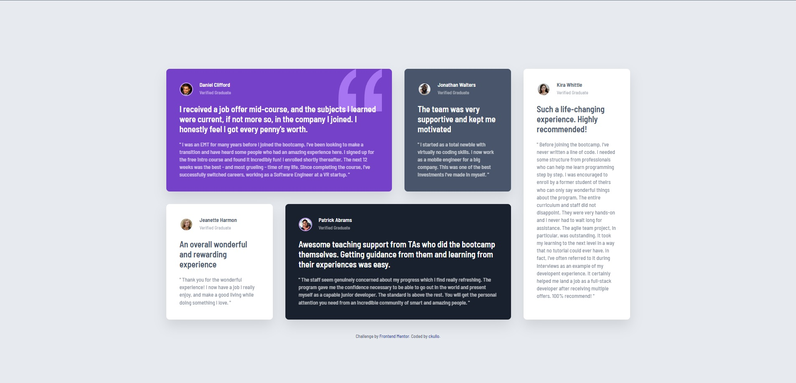

# Frontend Mentor - Testimonials grid section solution

This is a solution to the [Testimonials grid section challenge on Frontend Mentor](https://www.frontendmentor.io/challenges/testimonials-grid-section-Nnw6J7Un7). Frontend Mentor challenges help you improve your coding skills by building realistic projects. 

## Table of contents

- [Overview](#overview)
  - [The challenge](#the-challenge)
  - [Screenshot](#screenshot)
  - [Links](#links)
- [My process](#my-process)
  - [Built with](#built-with)
  - [Useful resources](#useful-resources)
- [Author](#author)

## Overview

### The challenge

- View the optimal layout for the site depending on their device's screen size

### Screenshot

### Links

- Solution URL: 
- Live Site URL: 

## My process

### Built with

- Semantic HTML5 markup
- CSS custom properties
- Flexbox
- CSS Grid
- Mobile-first workflow

### Useful resources

- [Flexbox](https://mastery.games/flexboxzombies/) - This helped me learning flexbox in a fun way.
- [CSS Grid](https://www.joshwcomeau.com/css/interactive-guide-to-grid/) - This is an amazing article which helped me finally understand CSS grid using interactive guide. I'd recommend it to anyone still learning this concept.

## Author

- Frontend Mentor - [@ckullo](https://www.frontendmentor.io/profile/ckullo)
